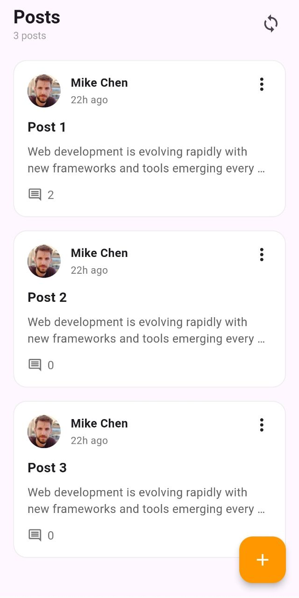
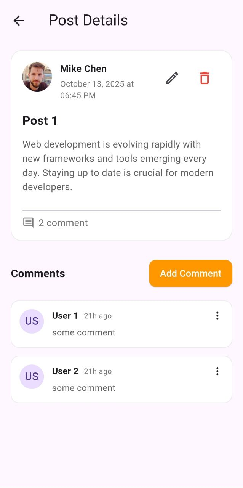
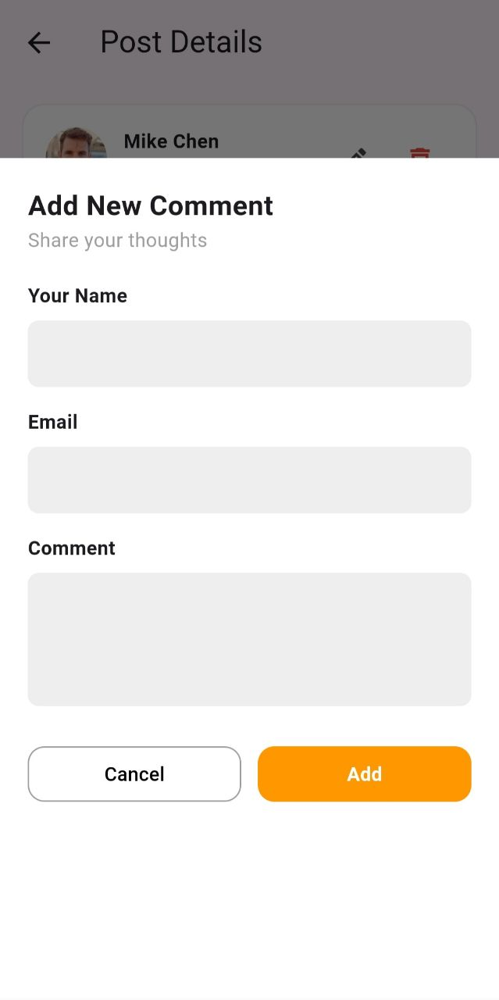

<h3>Screenshots</h3>

  
  
  
  

<h1 align="center">Flutter Posts App</h1>

  <strong>A professional Flutter application built with Clean Architecture and Provider.</strong>

<h3>Tech Stack</h3>
<ul>
  <li><b>State Management:</b> Provider</li>
  <li><b>Architecture:</b> Clean Architecture (Data, Domain, Presentation)</li>
  <li><b>Networking:</b> HTTP Package</li>
  <li><b>Validation:</b> Form & TextFormField Validation</li>
</ul>

<h3>Key Features</h3>
<ul>
  <li><b>Dynamic Fetching:</b> Get posts and comments from remote API.</li>
  <li><b>Content Management:</b> Add new posts and comments through interactive Bottom Sheets.</li>
  <li><b>Data Safety:</b> Delete posts with a customized confirmation dialog.</li>
  <li><b>Form Validation:</b> Email and content validation before submission.</li>
  <li><b>Clean UI:</b> Loading states and intuitive navigation.</li>
</ul>

<h3>Project Structure</h3>
<pre>
lib/
├── data/          # Data sources & Repository implementations
├── domain/        # Entities & Use Cases
└── presentation/  # Providers & UI Components
</pre>

